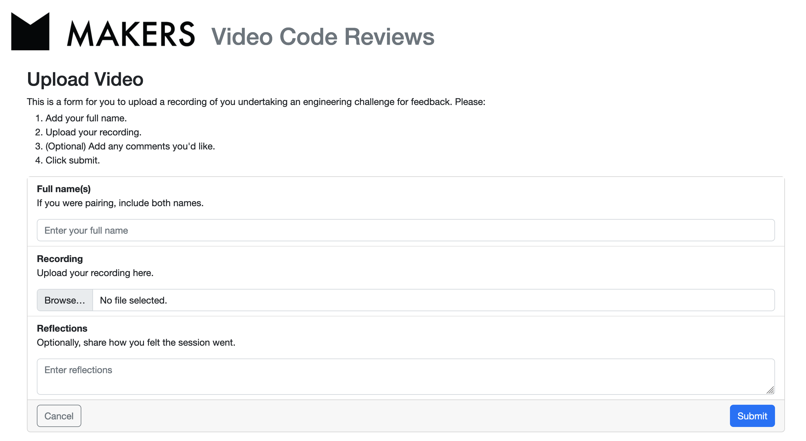

# Video Code Review 🎥
This is a working prototype of a Rails powered peer code review video platform. The primary objective of the project is to help students learn - they will receive feedback more quickly, and also develop their skills at reviewing the work of others'.

Links to submit video can be embedded into a curriculum, with a query param denoting the piece of content that is being submitted. The link directs a user to a form, where they can upload the video to a server. If another user has submitted a response to the same content, they will be asked if they could spare the time to review another student's work.

Course administrators can be provided with a dashboard to view all students' submissions to have oversight into the quality of the reviews provided.


***

***


## Setup
### Requirements
- Ruby 3.1.2
- NodeJS / Yarn
- Bundler gem installed
- PostgreSQL (with a superuser account named after your own terminal login, ideally)
    - `$ sudo su - postgres`
    - `$ psql`
    - `CREATE USER <YOUR TERMINAL USERNAME> WITH CREATEDB CREATEUSER;`


### Process
```
$ git clone https://github.com/ehwus/video-code-review
$ cd video-code-review
$ bundle install
$ bundle exec rails assets:precompile
$ bundle exec rails db:create && bundle exec rails db:migrate
$ rails s
```

### Run the Test Suite
```
$ bundle exec rspec
```

## Todo
- Integrate with a single sign in service
    - Authenticate Coaches having the ability to delete posts.
    - Confirm identities of those giving reviews to prevent abuse.
- Integrate with Slack / Email to give students notifications of new reviews for their submissions.
- Pagination and ranking algorithm on the Submissions dashboard.
